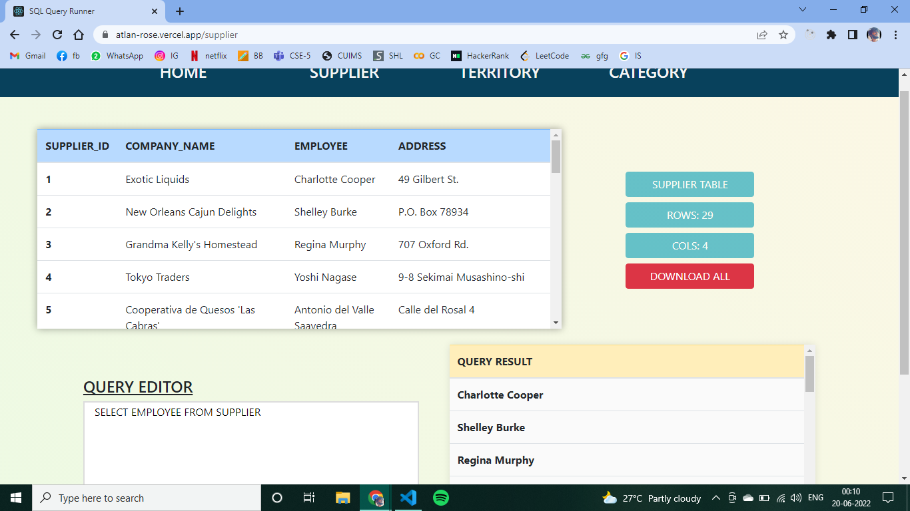
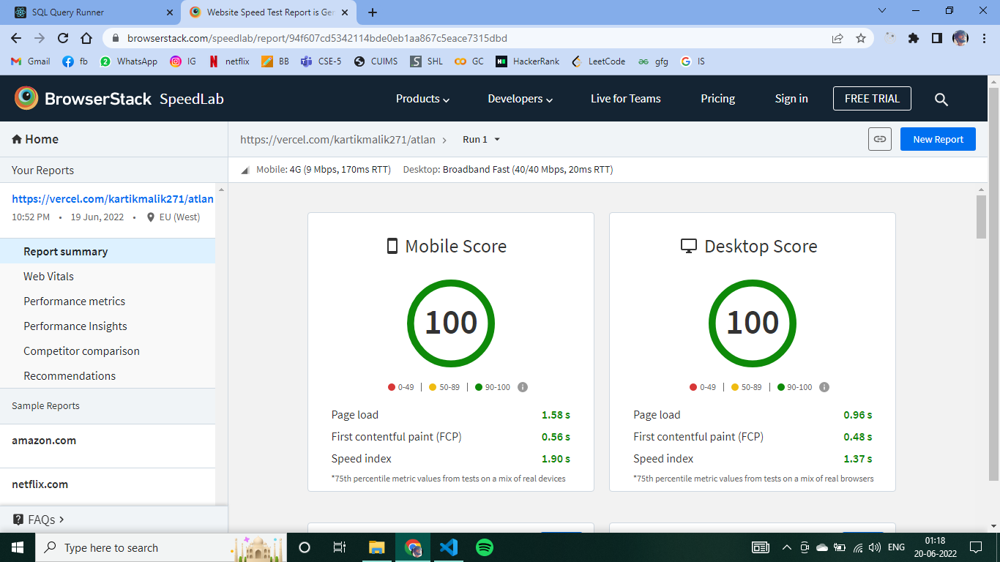

    #  SQL Query Runner

A REACT Application that takes SQL queries as input, processes it and exhibits the output within the application. 
#### Other features:

- Support multiple queries on **multiple** tables
- Have an option to **download** the processed results
- Shows other details such as table Name, number of rows and cols

## 👨🏻‍💻TECH STACK
- REACT.JS
- BOOTSTRAP
- D3
- REACT-CSV-DOWNLOADER

## 🚀DEMO

Try out: [SQL Query Runner](https://atlan-rose.vercel.app/)

## 🕔Page Load Time

 Page Load Time:  **0.96s** (Desktop Score) and  **1.58s** (Mobile Score)
 Results are calculated by **BrowserStack SpeedLab**
 
 - verification link  ->[LINK](https://www.browserstack.com/speedlab/report/94f607cd5342114bde0eb1aa867c5eace7315dbd)

